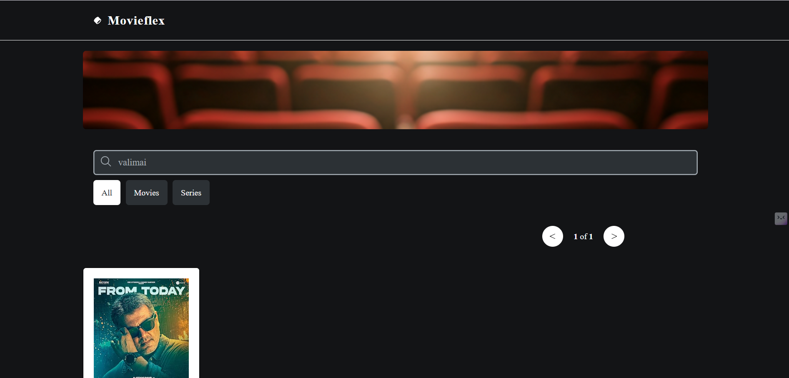
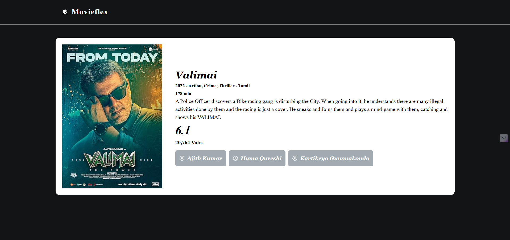
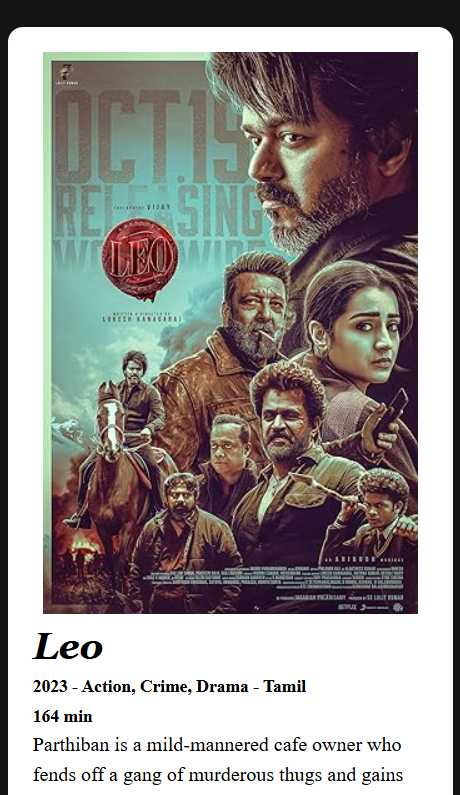

# 🎬 Movie Review Application - MovieFlex

A responsive and interactive movie review app built with **React JS** and **TailwindCSS**. Users can search and filter movies, view detailed information, and rate movies using a star-based system. The project demonstrates React state handling using hooks and data display from a public movie API (like OMDB) or mock JSON.

---

## ✨ Features

- **Movie Listings**
  - Browse a list of movies from mock data or a public API.
  - Key details: title, poster, release year, and genre.
  - Responsive grid layout.

- **Search & Filter**
  - Live search bar filters movies by title.
  - Filter movies by:
    - Genre
    - Release year
    - Average rating

- **Movie Details**
  - Click a movie to view details: description, (optional) cast, release info, etc.
  - Modern, readable detail layout.

- **Ratings**
  - Users can rate films (1–5 stars).
  - Visual display of average user rating per movie.
  - UI reflects your current rating instantly.

---

## 🛠️ Tech Stack

- [React JS](https://react.dev/) (frontend)
- [TailwindCSS](https://tailwindcss.com/) (styling)
- React Hooks (`useState`, `useEffect`)
- [OMDB API](https://www.omdbapi.com/) and mock JSON data

---

 🚀 Live Demo
🔗 [Click here to Search the Movie](https://movieflixwebs.netlify.app/)

### 💻 Desktop View
Full-screen experience with Movie Search.

--- 

### 📱 Mobile View
Responsive layout of the Movie Search App on a mobile screen.

---

## 🙌 Credits

Developed with ❤️ by [Ramana S](https://github.com/CodeRamana)

